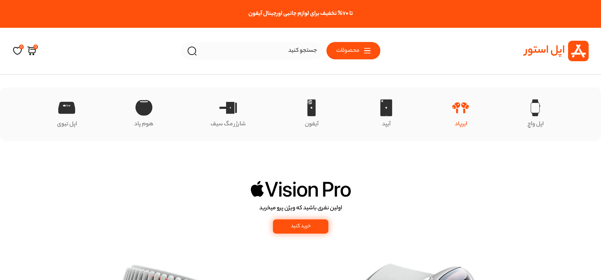
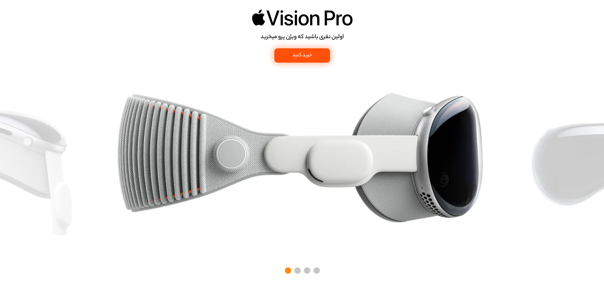
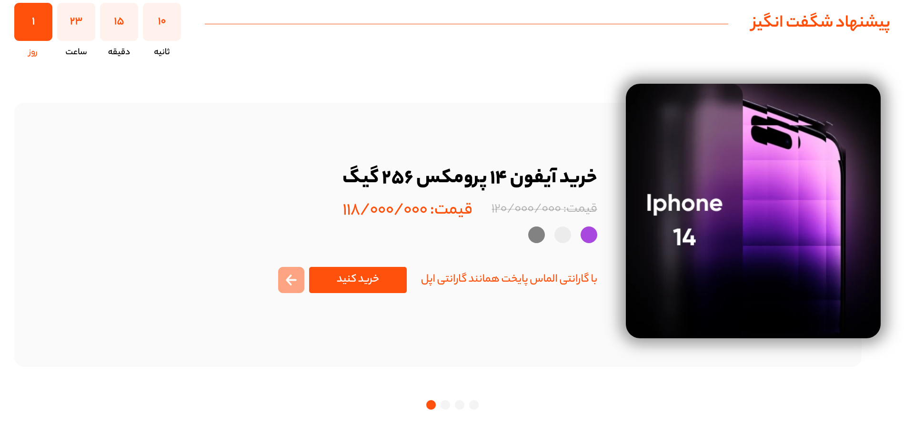
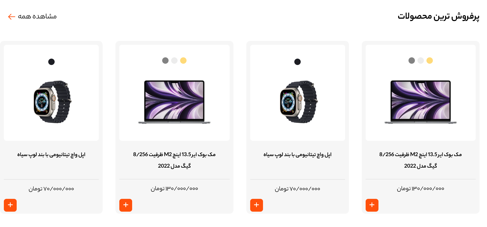
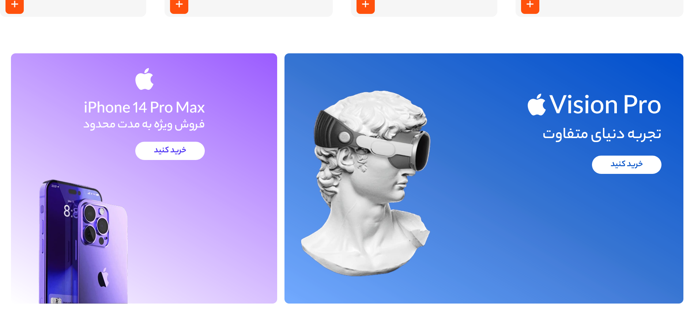
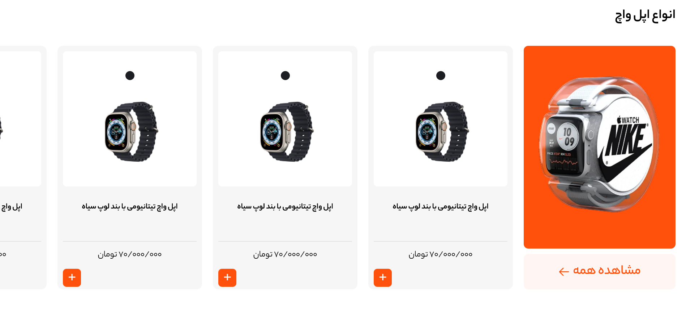
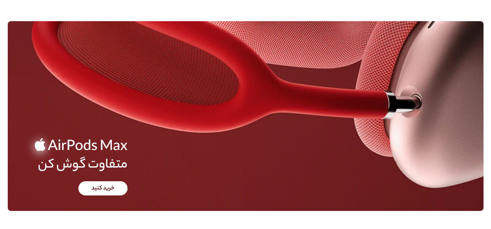
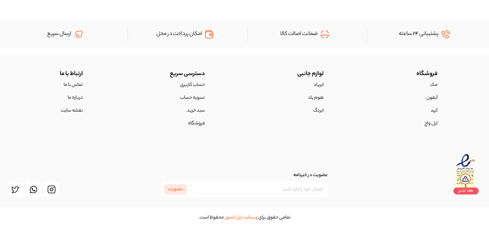
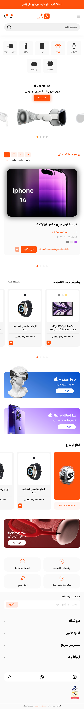

# Apple Store Landing Page

A responsive RTL e-commerce landing page built with **Tailwind CSS v4**.  
This project showcases a clean Apple-inspired storefront layout with reusable product sections, promotional banners, and responsive UI components.

## Features

- Responsive design for mobile, tablet, and desktop
- RTL support for Persian/Farsi content
- Tailwind CSS v4 utility-based styling
- Custom colors, shadows and gradients
- Product category navigation
- Promotional hero banners
- Featured products and best-seller cards
- Horizontal scrolling product lists on smaller screens
- Clean and modern Apple-style visual design

## Tech Stack

- HTML5
- Tailwind CSS v4
- Custom fonts
- Static assets (SVG, WebP)

## Setup

1. Install dependencies

```bash
npm install
```

2. Build Tailwind CSS

```bash
npx tailwindcss -i ./src/input.css -o ./dist/output.css --watch
```

3. Open `index.html` in your browser

## Notes

- The page is fully static and does not include JavaScript functionality yet.
- UI sections are built with Tailwind utility classes directly in HTML.
- The layout is optimized for responsiveness and Persian content direction.

## Screenshots










### Mobile View


